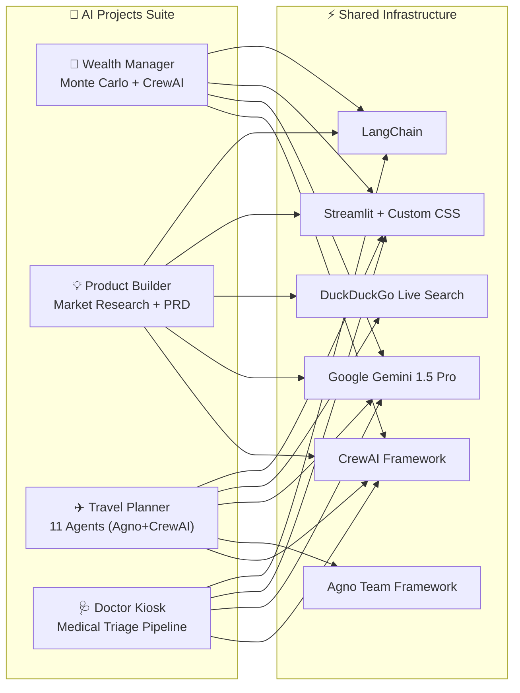

# 🧠 AI Projects — Ultimate Agentic AI Suite


A collection of **enterprise-grade, agentic AI applications** — each powered by multi-agent teams (CrewAI / Agno), Google Gemini Pro, and live internet research. Every app features a premium, glassmorphic dark-mode Streamlit UI.

---

## 🚀 The Suite

| # | Project | Agents | What It Does |
|---|---|---|---|
| 1 | [🏦 AI Wealth Manager](./ai_wealth_manager/) | 2 CrewAI Agents + Monte Carlo | Retirement planning, tax optimization, portfolio projections |
| 2 | [💡 AI Product Builder](./ai_product_builder/) | 3 CrewAI Agents + Live Search | Startup idea → PRD + market analysis + tech architecture |
| 3 | [✈️ AI Travel Trip Planner](./ai_travel_trip_planner/) | 7 Agno + 4 CrewAI Agents | The world's most comprehensive travel planner (11 agents!) |
| 4 | [🩺 AI Doctor Kiosk](./ai_doctor_kiosk/) | 3 CrewAI Agents | ER triage simulation: clinical summary → red flags → diagnosis |

---

## 🏗️ Suite Architecture



---

## 📁 Repository Structure

```
AI-projects/
├── ai_wealth_manager/         # 🏦 Financial planning + Monte Carlo
│   ├── app.py                 # Streamlit app (premium dark UI)
│   ├── wealth_crew.py         # CrewAI: Tax Strategist + Financial Planner
│   ├── monte_carlo.py         # Monte Carlo simulation engine
│   └── requirements.txt
│
├── ai_product_builder/        # 💡 Startup idea → full business plan
│   ├── app.py                 # Streamlit app (futuristic UI)
│   ├── product_crew.py        # CrewAI: Market Researcher + CPO + Architect
│   └── requirements.txt
│
├── ai_travel_trip_planner/    # ✈️ 11-agent travel intelligence platform
│   ├── streamlit_app.py       # Streamlit app (space-grade UI)
│   ├── workflow.py            # Agno 7-agent team
│   ├── travel_crew.py         # CrewAI 4-agent crew
│   ├── main.py                # Data models & core logic
│   └── requirements.txt
│
├── ai_doctor_kiosk/           # 🩺 AI medical triage simulation
│   ├── app.py                 # Streamlit app (clinical dark UI)
│   ├── medical_crew.py        # CrewAI: Nurse + Safety + Diagnostician
│   └── requirements.txt
│
└── README.md                  # This file
```

---

## ⚡ Quick Start (Any App)

```bash
# 1. Clone the repo
git clone https://github.com/Yashitaggarwal/AI-projects.git
cd AI-projects

# 2. Pick any app
cd ai_wealth_manager  # or ai_product_builder, ai_travel_trip_planner, ai_doctor_kiosk

# 3. Install dependencies
pip install -r requirements.txt

# 4. Set your Gemini API key
echo "GEMINI_API_KEY=your_key_here" > .env

# 5. Run
streamlit run app.py  # (or streamlit_app.py for travel planner)
```

---

## 🔑 API Keys Required

| Key | Where To Get It | Used By |
|---|---|---|
| `GEMINI_API_KEY` | [Google AI Studio](https://aistudio.google.com/app/apikey) | All 4 apps |

---

## 💻 Tech Stack

| Technology | Purpose |
|---|---|
| **CrewAI** | Multi-agent sequential pipelines |
| **Agno** | Collaborative multi-agent teams with delegation |
| **Google Gemini 1.5 Pro** | Core LLM for all agents |
| **LangChain** | LLM integration layer |
| **DuckDuckGo Search** | Live internet research |
| **Streamlit** | Premium interactive web UIs |
| **NumPy / Plotly** | Monte Carlo simulations & charts |
| **Pydantic** | Data validation & structured models |

---

## 📄 License

MIT License

---

**Built by [Yashit Aggarwal](https://github.com/Yashitaggarwal)** — Agentic AI Developer
