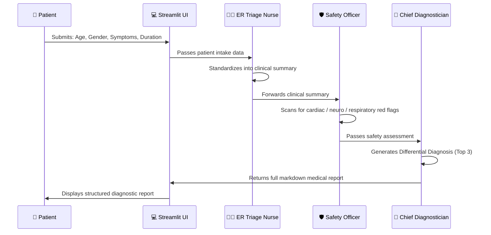

# 🩺 AI Doctor Kiosk (Simulation)


> ⚠️ **DISCLAIMER**: This application generates responses using Artificial Intelligence. It is **NOT** a substitute for professional medical advice, diagnosis, or treatment. Always seek the advice of your physician for any medical condition.

The **AI Doctor Kiosk** is a state-of-the-art, AI-powered **emergency room triage simulation**. It deploys a sequential crew of three specialized medical AI agents — mirroring a real-world hospital intake workflow — to analyze patient symptoms, flag critical red-flag conditions, and generate a differential diagnosis report.

---

## ✨ Features

- 🏥 **Multi-Agent Medical Pipeline**: Three sequential agents mirror real hospital triage protocols.
- 🚨 **Red-Flag Detection**: A dedicated Safety Officer agent scans for life-threatening symptoms (cardiac events, neurological emergencies, severe respiratory distress).
- 🔬 **Differential Diagnosis**: A Chief Diagnostician generates the top 3 most probable conditions, ranked probabilistically.
- 📋 **Structured Clinical Report**: Outputs a professional, well-formatted medical report with a clear "Next Steps" section.
- 🖥️ **Clinical Dark UI**: Premium dark-mode interface with a clean, clinical aesthetic using deep teals and high-contrast warning states.

---

## 🏗️ Medical Triage Architecture Flow



### Agent Details

| Agent | Role | Output |
|---|---|---|
| 👩‍⚕️ ER Triage Nurse | Standardizes chaotic patient descriptions into a professional clinical note | Clinical Summary |
| 🛡️ Medical Safety Officer | Scans for life-threatening red-flag symptoms and escalates immediately | Safety Assessment (Warning / Clear) |
| 🔬 Chief Diagnostician | Probabilistically ranks top 3 conditions; provides actionable "Next Steps" | Full Differential Diagnosis Report |

---

## 💻 Tech Stack

| Layer | Technology |
|---|---|
| **Frontend** | Streamlit + Custom CSS (Clinical Dark Mode) |
| **AI Framework** | CrewAI (Sequential Process) |
| **LLM Engine** | Google Gemini Pro (via `langchain-google-genai`) |
| **Font** | Google Fonts — Roboto |

---

## 🚀 Getting Started

1. **Install Dependencies**:
   ```bash
   pip install -r requirements.txt
   ```

2. **Run the App**:
   ```bash
   streamlit run app.py
   ```

3. **Enter your Gemini API Key** in the sidebar, fill in the patient intake form, and click **Run Diagnostic Triage**.

---

## 📁 Project Structure

```
ai_doctor_kiosk/
├── app.py              # Main Streamlit application + premium clinical UI
├── medical_crew.py     # CrewAI agent definitions (Nurse, Safety, Diagnostician)
└── requirements.txt    # Python dependencies
```
