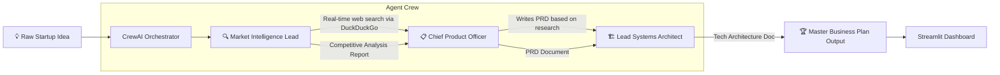

# 💡 AI Co-Founder & Product Builder


The **AI Co-Founder & Product Builder** is an agentic startup co-founder in your browser. Input your raw idea — in seconds, a team of AI agents performs real-time competitive research, writes a full Product Requirements Document (PRD), and designs a technical architecture — all autonomously.

---

## ✨ Features

- 🔍 **Live Market Research**: Uses DuckDuckGo search to analyze real competitors and market landscape.
- 📄 **PRD Generation**: Writes a comprehensive Product Requirements Document with user personas, MVP feature sets, and "aha moments".
- 🏗️ **Tech Stack Design**: Proposes a pragmatic, scalable technology stack (Frontend, Backend, Database, AI APIs) tailored to your idea.
- 🎨 **Stunning Dark UI**: Premium futuristic design with glowing gradients, `Outfit` font typography and micro-animations.

---

## 🏗️ Architecture & Agent Flow



### Agent Details

| Agent | Role | Tool |
|---|---|---|
| 🔍 Market Intelligence Lead | Finds competitors, market size, and trends | DuckDuckGo Search |
| 📋 Chief Product Officer | Writes PRD, defines user personas & MVP | None (Reasoning) |
| 🏗️ Lead Systems Architect | Designs scalable tech stack for the MVP | None (Reasoning) |

---

## 💻 Tech Stack

| Layer | Technology |
|---|---|
| **Frontend** | Streamlit + Custom CSS (Glassmorphism Dark Mode) |
| **AI Framework** | CrewAI |
| **LLM Engine** | Google Gemini Pro (via `langchain-google-genai`) |
| **Web Search Tool** | DuckDuckGo Search (`duckduckgo-search`) |

---

## 🚀 Getting Started

1. **Install Dependencies**:
   ```bash
   pip install -r requirements.txt
   ```

2. **Run the App**:
   ```bash
   streamlit run app.py
   ```

3. **Enter your Gemini API Key** in the sidebar and type your startup idea to get started.

---

## 📁 Project Structure

```
ai_product_builder/
├── app.py              # Main Streamlit application + premium UI
├── product_crew.py     # CrewAI agent definitions and task pipeline
└── requirements.txt    # Python dependencies
```
