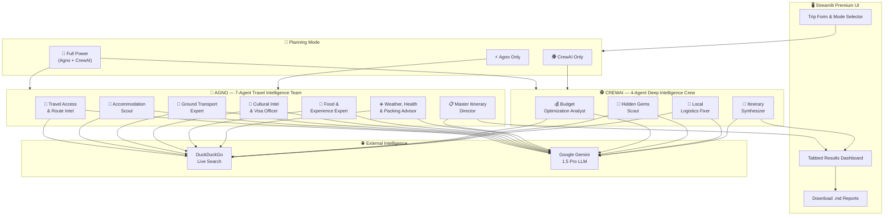

# ✈️ AI Travel Trip Planner — The Ultimate Agentic Travel Intelligence Platform


The **AI Travel Trip Planner** is the most comprehensive agentic travel planning platform ever built. It deploys **11 specialized AI agents** (7 Agno + 4 CrewAI) that autonomously research, plan, and compile every possible detail a traveler needs — for **any destination on Earth**, whether reachable by plane, train, ferry, bus, or road.

> **Not just flights.** Whether you're heading to a remote Himalayan village with no airport, an island accessible only by ferry, or a cross-continental road trip — this platform figures out **every way to get there** and builds you the perfect plan.

---

## 🌟 Why This Exists

Most travel planners focus on flights and hotels. Real travel is infinitely more complex:

- **How do I actually GET there?** (Maybe there's no airport — you need a train + bus combo)
- **What visa do I need?** (And what about transit visas at layover points?)
- **What are locals ACTUALLY eating?** (Not the tourist-trap TripAdvisor recommendations)
- **What are the scams I should watch out for?**
- **What do I pack for THIS specific climate at THIS time of year?**
- **What's the REAL daily budget?** (Not the blog-inflated version)
- **What hidden gems exist that guidebooks don't cover?**

This platform answers **ALL of that** — autonomously, with live internet research, in seconds.

---

## 🏗️ System Architecture



---

## 🤖 The 11-Agent Intelligence Network

### Agno Team — 7 Specialist Agents

| # | Agent | What It Does | Uses Web Search? |
|---|---|---|---|
| 1 | 🚂 **Travel Access & Route Intel** | Finds ALL ways to reach the destination — flights, trains, ferries, buses, road trips, multi-modal combos. Not every place has an airport! | ✅ Yes |
| 2 | 🏨 **Accommodation Scout** | Searches for best neighborhoods, hotels at 3 budget tiers, areas to avoid, booking platform comparisons | ✅ Yes |
| 3 | 🚌 **Ground Transport Expert** | Airport/station transfers, metro systems, ride-hailing apps, car rental, inter-city options, peak hours | ✅ Yes |
| 4 | 🛂 **Cultural Intel & Visa Officer** | Visa requirements, currency exchange, cultural dos/don'ts, local phrases, tipping culture, emergency numbers | ✅ Yes |
| 5 | 🍜 **Food & Experience Expert** | Must-eat dishes, street food spots, fine dining, hidden gems, day trips, local markets, food scams to avoid | ✅ Yes |
| 6 | ☀️ **Weather & Packing Advisor** | Weather forecast for travel dates, best/worst season assessment, health risks, vaccines, complete packing list | ✅ Yes |
| 7 | 📋 **Master Itinerary Director** | Synthesizes ALL research into a day-by-day, hour-by-hour plan with transport, meals, costs, and pro tips | ❌ (Synthesis) |

### CrewAI Crew — 4 Deep-Dive Agents

| # | Agent | What It Does | Uses Web Search? |
|---|---|---|---|
| 1 | 💰 **Budget Optimization Analyst** | Builds complete cost breakdown across every category with money-saving hacks | ✅ Yes |
| 2 | 💎 **Hidden Gems Scout** | Finds off-the-beaten-path locations, local-only spots, secret viewpoints, underground events | ✅ Yes |
| 3 | 🔧 **Local Logistics Fixer** | SIM cards, ATMs, pharmacy locations, local apps, common scams, power adapters, photography rules | ✅ Yes |
| 4 | 📅 **Itinerary Synthesizer** | Compiles budget + gems + logistics into a beautifully themed day-by-day plan | ❌ (Synthesis) |

---

## 💻 Complete Tech Stack

| Layer | Technology | Purpose |
|---|---|---|
| **Frontend** | Streamlit + Custom CSS | Premium glassmorphic dark-mode UI |
| **Multi-Agent Framework** | Agno | 7-agent collaborative team with delegation |
| **Agentic Framework** | CrewAI | 4-agent sequential pipeline with task chaining |
| **LLM Engine** | Google Gemini 1.5 Pro | Core reasoning and synthesis |
| **LLM Integration** | LangChain Google GenAI | CrewAI ↔ Gemini bridge |
| **Live Web Search** | DuckDuckGo Search | Real-time flight, hotel, culture, weather data |
| **Data Validation** | Pydantic | Structured traveler info and flight preferences |
| **Environment** | python-dotenv | API key management |
| **Typography** | Google Fonts (Inter) | Premium UI typography |

---

## 📁 Project Structure

```
ai_travel_trip_planner/
├── streamlit_app.py       # Main Streamlit application — premium UI, mode selector, tabs
├── workflow.py            # Agno 7-agent team definition and execution
├── travel_crew.py         # CrewAI 4-agent crew definition and execution
├── main.py                # Core data models (TravelerInfo, FlightPreferences, etc.)
├── deligator.py           # Gemini-powered tour info extraction (IATA codes, dates)
├── itinerary_writer.py    # Itinerary writing & formatting utilities
├── grounding_service.py   # Google Grounding API integration for structured extraction
├── city_database.py       # City and airport database
├── places.py              # Places of interest data layer
├── places_tools.py        # Places search tools (SerpAPI integration)
├── flights.py             # Flight search tools (SerpAPI integration)
├── hotels.py              # Hotel search tools (SerpAPI integration)
├── image_handler.py       # Image processing utilities
├── prompt.py              # Prompt templates and engineering
├── requirements.txt       # All Python dependencies
└── README.md              # This file
```

---

## 🚀 Getting Started

### Prerequisites
- Python 3.10+
- A Google Gemini API key ([Get one here](https://aistudio.google.com/app/apikey))

### Installation

```bash
# Navigate to the project
cd ai_travel_trip_planner

# Install dependencies
pip install -r requirements.txt

# Set your API key
echo "GEMINI_API_KEY=your_key_here" > .env
# OR
echo "GOOGLE_API_KEY=your_key_here" > .env
```

### Run

```bash
streamlit run streamlit_app.py
```

The app will open at `http://localhost:8501`.

---

## 🎮 How To Use

1. **Enter your API key** in the sidebar (or set it in `.env`)
2. **Fill in trip details**: departure city, destination, dates, number of travelers
3. **Set your budget** (or leave at 0 for flexible multi-tier recommendations)
4. **Select special preferences**: toddler-friendly, senior-accessible, safety assessment
5. **Choose planning mode**:
   - 🚀 **Full Power** — runs both Agno (7 agents) AND CrewAI (4 agents)
   - ⚡ **Agno Only** — comprehensive itinerary with all travel dimensions
   - 🕵️ **CrewAI Only** — deep local intelligence (budget, hidden gems, logistics)
6. **Click Generate** and let the 11 AI agents work
7. **Explore results** in tabs: Full Itinerary, Hidden Gems & Local Tips, Trip Summary
8. **Download** your personalized travel guide as `.md` files

---

## 🌍 Example Destinations It Handles

| Scenario | Why It's Special |
|---|---|
| Mumbai → Ladakh | No commercial airport at many spots — finds train + bus + shared taxi combos |
| London → Santorini | Ferry from Athens vs direct flight comparison |
| Delhi → Bhutan | Only Druk Air flies there — explains the process |
| New York → Antarctica | Cruise from Ushuaia — multi-modal extreme planning |
| Bangkok → Luang Prabang | Overnight sleeper train vs short flight trade-off |
| Road trip: LA → San Francisco | Pacific Coast Highway route planning |

---

## 📄 License

MIT License. Built for educational purposes and portfolio demonstration.