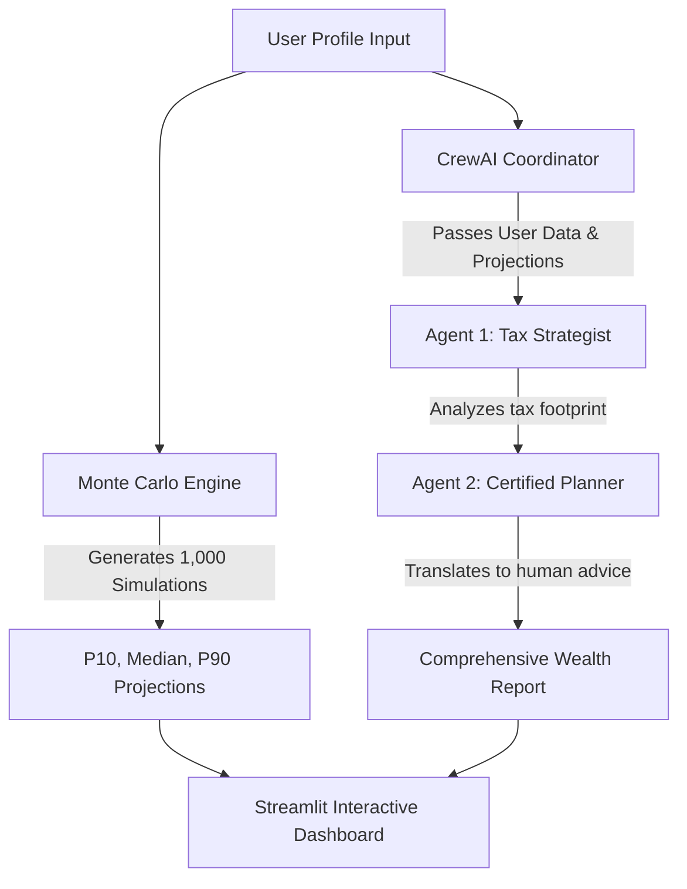

# 🏦 AI Wealth Manager & Retirement Planner


The **AI Wealth Manager** is an enterprise-grade financial planning application that combines the rigorous mathematical precision of **Monte Carlo Simulations** with the cognitive reasoning capabilities of an **AI Agent Crew (CrewAI)** to provide holistic, hyper-personalized retirement and tax strategies.

## ✨ Features
- **Monte Carlo Projections**: Runs thousands of mathematical simulations using historical data and risk profiles to predict your portfolio trajectory to retirement.
- **Agentic Analysis**: Uses **CrewAI** to spawn two expert agents:
  1. A **Senior Tax & Wealth Strategist** (CPA/CFP equivalent)
  2. A **Certified Financial Planner (CFP)**
- **Stunning UI**: Features a premium, state-of-the-art dark-mode dashboard built with custom CSS, glassmorphism, and responsive micro-animations.

## 🏗️ Architecture Flow



## 💻 Tech Stack
- **Frontend**: Streamlit (with Premium Custom CSS)
- **Data & Math**: Python, NumPy, Pandas, Plotly (for stunning interactive graphs)
- **AI Framework**: CrewAI
- **LLM Engine**: Google Gemini Pro (via LangChain Google GenAI)

## 🚀 Getting Started

1. **Install Dependencies**:
   ```bash
   pip install -r requirements.txt
   ```
2. **Set Environment Variables**:
   Create a `.env` file and add your `GEMINI_API_KEY`:
   ```env
   GEMINI_API_KEY=your_key_here
   ```
3. **Run the Application**:
   ```bash
   streamlit run app.py
   ```
